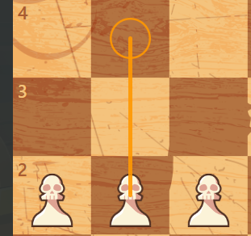
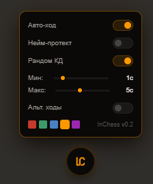

# InChess: Advanced Chess Analysis Framework

A high-performance browser extension for real-time chess data visualization and behavioral simulation. Built with a focus on minimalist UX and high-fidelity execution.

## Overview

InChess provides a sophisticated analytical layer over chess platforms, utilizing custom search algorithms and advanced DOM manipulation to enhance the tactical experience.

  
  

<i>Visualizing tactical depth with Godlike Precision and a premium monochrome aesthetic.</i>

## Key Features

* **Behavioral Simulation:** Implements human-like input emulation via linear path interpolation and adaptive timing logic.
* **Analytical Engine:** Integrated search core with iterative deepening and transposition tables for near-instant tactical evaluation.
* **Stealth Integration:** Pure DOM-based interaction logic that operates without script injection or global namespace pollution.
* **Neuro-Protect UI:** Dynamic data masking for streaming, including real-time nickname and avatar replacement.

## Technical Stack

* **Logic:** JavaScript (ES6+)
* **UI/UX:** Instrument Sans Typography / Custom CSS Grid
* **Communication:** Chrome Runtime Messaging API

## Installation

1. Clone the repository.
2. Open chrome://extensions/ in your browser.
3. Enable Developer Mode.
4. Click Load Unpacked and select the project directory.

---
*Created for educational research in behavioral analysis and automation.*
